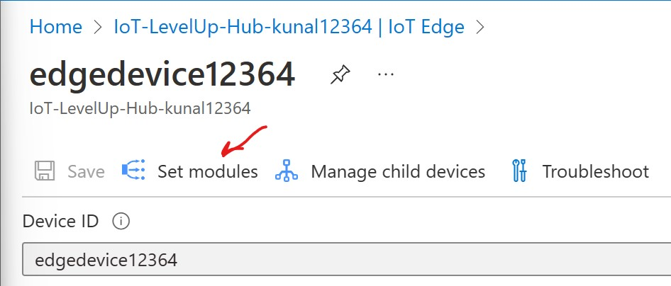
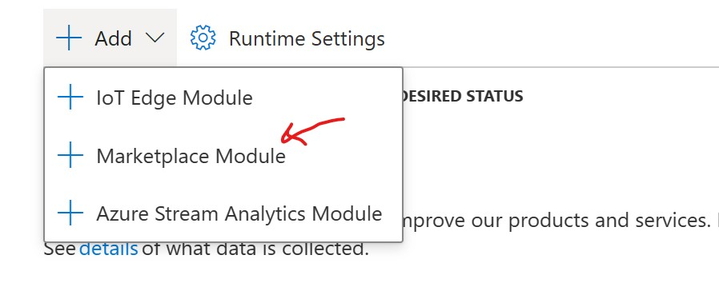
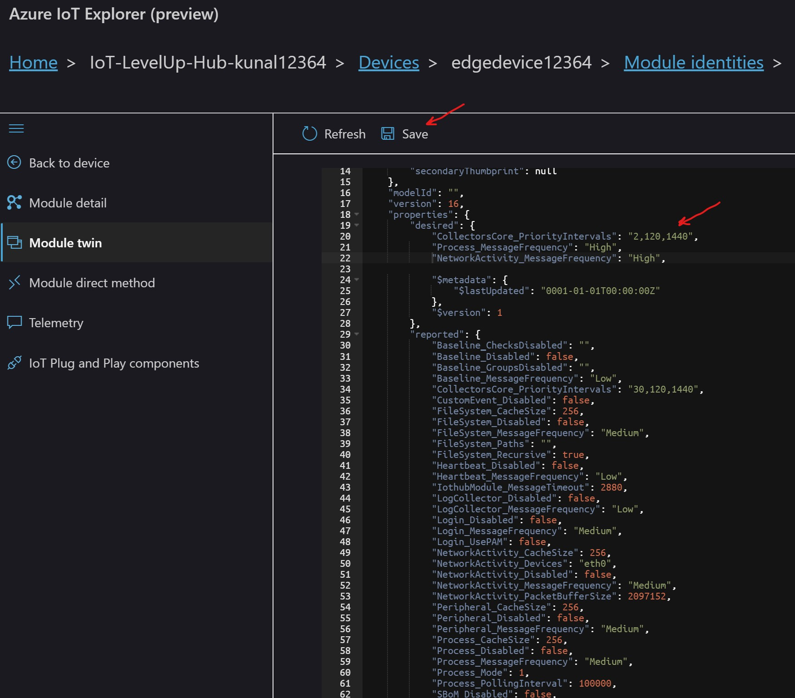
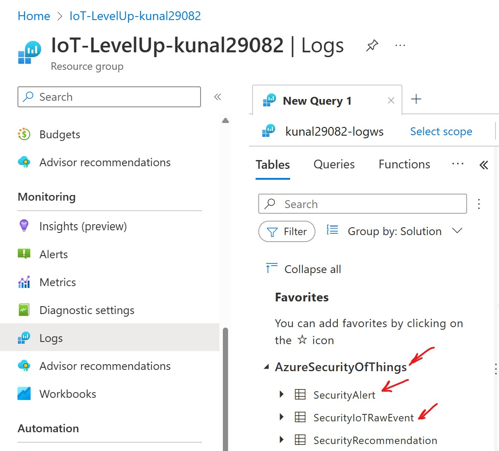

# IoT Edge & Defender for IoT Micro Agent Lab

## Lab 1: Install IoT Edge & Deploy Module on VM

### 1. Open Cloud Shell and  SSH into VM to install Moby (Docker), IoT Edge & Micro Agent
```
ssh -i .ssh/id_rsa $USER@$publicIp

# if cloud shell was timed out, restore parameters using following command and then retry
source myconfig.log

```
### Get Microsoft package list and add as source
```
    wget https://packages.microsoft.com/config/ubuntu/20.04/packages-microsoft-prod.deb -O packages-microsoft-prod.deb
    sudo dpkg -i packages-microsoft-prod.deb
    rm packages-microsoft-prod.deb
```
### Update package list and install Moby (Docker)
```
    sudo apt-get update; \
    sudo apt-get install moby-engine
```
### Check if docker is running 
```
    systemctl status docker
```
### Update package list and install IoT Edge and Defender micro agent
```
    sudo apt-get update;
    sudo apt-get install aziot-edge defender-iot-micro-agent-edge
```
### Configure IoT Edge runtime with Edge Device Connection String and apply configuration. Use connection string saved in Prerequisites Step 4, which we also copied to variable $DEVICECONNECTIONSTRING. 
### Example:  sudo iotedge config mp --connection-string "REPLACE ME WITH DEVICE CONNECTION STRING"
```
    sudo iotedge config mp --connection-string $DEVICECONNECTIONSTRING
    sudo iotedge config apply
```
### Check IoT Edge Service Logs
```
    sudo iotedge system logs -- -f
```
### Check what edge modules are running, either of the commands
```
    sudo iotedge list

    sudo docker ps
```
### Check defender service logs
```
     journalctl -u defender-iot-micro-agent --follow
```

## 2. Deploy Simulated Temperature & Humidity Module on IoT Edge

# Portal

1. Open IoT Edge device in IoT Hub

2. Select Set Modules 

3. Add marketplace module 

4. Search for "Simulated Temperature Sensor", Select

5. Click Routes, review the route

6. Click Review+Create to see the full Deployment manifest, detailing all modules, routes and associated desired properties 

7. Click Create to deploy modules to IoT Edge

8. Open Cloud shell, ssh into VM to view portal and shell together. Run following in shell to see edgeAgent log showing module deployment 
    ```
    ssh -i .ssh/id_rsa $USER@$publicIp
    iotedge logs -f edgeAgent
    ```
    

9. Open Azure Device Explorer and add IoTHub connection using saved IoT Hub connection string 
    

    Open edge device and select 'Telemetry" option on left blade.

    

10. Click Start to observe Temperature readings arriving in IoTHub

## Lab 3: Configure Defender for IoT in IoT Hub

1. In Azure Portal, open IoTHub, select settings & click "Secure your IoT Solution" button > 

2. Refresh page and open Data Collection setting 

3. Enable "Microsoft Defender for IoT, choose Log Analytics workspace created during prerequisites, enable "Access to raw security data" and save

4. Go back to previous pane and review REcommendations Configuration , by default all are enabled.

5. Go back to previous pane and under Monitored Resources select your subscription and resource group. Defender will start monitoring resources under this group, you may need to refresh page.

6. Go back to previous and review available custom alerts that can be added. This allows us to choose specific alerts not configured by default.

7. By default microagent reports HIGH/MEDIUM/LOW priority events in 30/120/1440 minute intervals respectively. In this lab we will configure HIGH priority alert to 2 minutes to avoid waiting and change MEDIUM priority to HIGH for Process and Network activity. Open Azure Device Explorer, select IoT Edge device and under Module Identities open "DefenderIotMicroAgent" module and select Module twin. Copy following properties under desired properties. This can also be done in Azure Portal - IoT Hub blade.

    ```
    "CollectorsCore_PriorityIntervals": "2,120,1440",
    "Process_MessageFrequency": "High",
    "NetworkActivity_MessageFrequency": "High",

    ```
    

## Lab 3: Analytics

1. Open IoTHub and select Overview under the Defender menu on left blade. 

2. Review Resource health by severity, click for more details. Initial events may take upto 15mins in some cases.

3. Review your device alert by clicking your edge device

4. Open "Logs" under Monitoring menu on the left blade and close "Welcome to Log Analytics" and Query Wizard dialog to get to Query form. Uncheck resource group and select workspace as your scope 

5. Review Tables created under "AzureSecurityOfThings"
    

6. Start process and network activity to trigger test security event on IoT Edge by running netcat command as below in the VM shell.
    ```
    nc -zv 8.8.8.8 53

    ```
7.  Copy following queries in query field, select either one and click Run to get the event logged into log analytics.
    ```
    SecurityIoTRawEvent | where parse_json(EventDetails).Commandline contains '8.8.8.8'

    SecurityIoTRawEvent | where parse_json(EventDetails).RemoteAddress == '8.8.8.8'

    ```
    

8. Explore event details by selecting event 


#   Congratulations! You have completed IoT Edge & Defender Micro Agent Lab

## Dont forget to clean up resources, open cloud shell and delete your resource group

```
az group delete --name $resourceGroup

```
